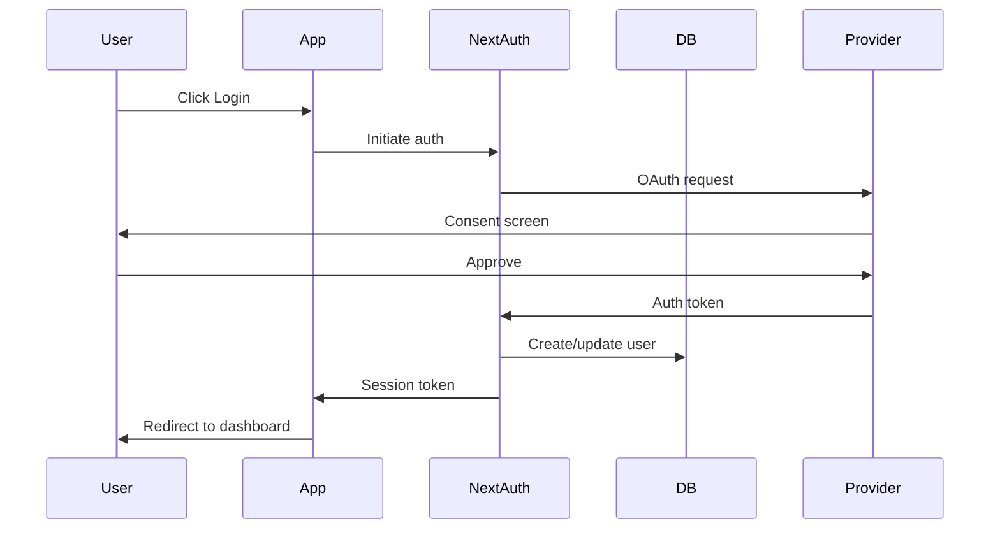

# Pulse - Technical Architecture

> Bio page builder inspired by keepo.bio

## Technology Stack

### Frontend

| Technology        | Purpose                                 |
| ----------------- | --------------------------------------- |
| **Next.js 14+**   | React framework with App Router         |
| **TypeScript**    | Type safety                             |
| **Tailwind CSS**  | Utility-first styling (user preference) |
| **Framer Motion** | Animations and transitions              |
| **next-pwa**      | PWA capabilities                        |
| **next-intl**     | Internationalization (PT-BR, EN)        |

### Backend

| Technology             | Purpose                                    |
| ---------------------- | ------------------------------------------ |
| **Next.js API Routes** | API endpoints                              |
| **Prisma**             | ORM for database                           |
| **Vercel Postgres**    | Primary database                           |
| **NextAuth.js**        | Authentication                             |
| **Mock Payments**      | Payment simulation (future: real provider) |

### Mobile (PWA + Native)

| Technology            | Purpose               |
| --------------------- | --------------------- |
| **Capacitor**         | Native mobile wrapper |
| **@capacitor/core**   | Core native APIs      |
| **@capacitor/camera** | Profile photo upload  |
| **@capacitor/share**  | Native sharing        |

### DevOps & Hosting

| Technology          | Purpose            |
| ------------------- | ------------------ |
| **Vercel**          | Hosting platform   |
| **Vercel Postgres** | Managed PostgreSQL |
| **Vercel Blob**     | Image/file storage |

---

## Project Structure

```
keepo-clone/
├── docs/                     # Documentation
│   ├── FEATURES.md
│   ├── ARCHITECTURE.md
│   ├── DATABASE.md
│   └── API.md
├── PROGRESS.md               # Implementation progress tracking
├── src/
│   ├── app/                  # Next.js App Router
│   │   ├── [locale]/         # Internationalized routes
│   │   │   ├── (auth)/       # Auth pages (login, register)
│   │   │   ├── (dashboard)/  # Authenticated dashboard
│   │   │   ├── (marketing)/  # Public pages (home, pricing)
│   │   │   └── [username]/   # Public bio pages
│   │   ├── api/              # API routes
│   │   └── globals.css
│   ├── components/
│   │   ├── blocks/           # Bio page block components
│   │   │   ├── LinkBlock.tsx
│   │   │   ├── HighlightBlock.tsx
│   │   │   ├── MediaBlock.tsx
│   │   │   ├── CatalogBlock.tsx
│   │   │   ├── FormBlock.tsx
│   │   │   └── SocialIconsBlock.tsx
│   │   ├── editor/           # Page editor components
│   │   │   ├── BlockEditor.tsx
│   │   │   ├── BlockPicker.tsx
│   │   │   └── DragDropArea.tsx
│   │   ├── ui/               # Shared UI components
│   │   └── layout/           # Layout components
│   ├── lib/
│   │   ├── db.ts             # Prisma client
│   │   ├── auth.ts           # NextAuth config
│   │   ├── stripe.ts         # Stripe config
│   │   └── utils.ts          # Helper functions
│   ├── hooks/                # Custom React hooks
│   ├── types/                # TypeScript types
│   ├── i18n/                 # Internationalization
│   │   ├── messages/
│   │   │   ├── en.json
│   │   │   └── pt-BR.json
│   │   └── config.ts
│   └── styles/
│       └── themes.ts         # Color themes
├── prisma/
│   └── schema.prisma         # Database schema
├── public/
│   ├── icons/                # PWA icons
│   └── manifest.json         # PWA manifest
├── android/                  # Capacitor Android
├── ios/                      # Capacitor iOS
├── capacitor.config.ts
├── next.config.js
├── tailwind.config.js
└── package.json
```

---

## Color System

### Primary Palette

```css
/* Orange (Primary Actions) */
--orange-50: #fff7ed;
--orange-100: #ffedd5;
--orange-200: #fed7aa;
--orange-300: #fdba74;
--orange-400: #fb923c;
--orange-500: #f97316; /* Primary */
--orange-600: #ea580c;
--orange-700: #c2410c;
--orange-800: #9a3412;
--orange-900: #7c2d12;

/* Purple (Secondary/Accent) */
--purple-50: #faf5ff;
--purple-100: #f3e8ff;
--purple-200: #e9d5ff;
--purple-300: #d8b4fe;
--purple-400: #c084fc;
--purple-500: #a855f7; /* Primary */
--purple-600: #9333ea;
--purple-700: #7c3aed;
--purple-800: #6b21a8;
--purple-900: #581c87;
```

### Theme Definitions

**Light Theme**

```css
--background: #ffffff;
--foreground: #0f0f0f;
--card: #f8f8f8;
--card-foreground: #0f0f0f;
--primary: var(--orange-500);
--secondary: var(--purple-500);
--muted: #f1f5f9;
--border: #e2e8f0;
```

**Dark Theme**

```css
--background: #0f0f0f;
--foreground: #fafafa;
--card: #1a1a1a;
--card-foreground: #fafafa;
--primary: var(--orange-400);
--secondary: var(--purple-400);
--muted: #27272a;
--border: #3f3f46;
```

---

## Authentication Flow



---

## Internationalization Strategy

### Language Detection Priority

1. URL locale prefix (e.g., `/pt-BR/dashboard`)
2. User preference (stored in cookie/localStorage)
3. `Accept-Language` header
4. Default to `pt-BR`

### Implementation

```typescript
// i18n/config.ts
export const locales = ["pt-BR", "en"] as const;
export const defaultLocale = "pt-BR";

// Middleware detects and redirects
```

---

## PWA Configuration

### Capabilities

- Offline support (service worker)
- Install prompt
- Push notifications (future)
- Full-screen mode on mobile

### manifest.json

```json
{
  "name": "BioLink - Seu minisite profissional",
  "short_name": "BioLink",
  "theme_color": "#f97316",
  "background_color": "#0f0f0f",
  "display": "standalone",
  "start_url": "/",
  "icons": [...]
}
```

---

## Capacitor Integration

### Native Features

| Feature   | Capacitor Plugin      | Use Case         |
| --------- | --------------------- | ---------------- |
| Camera    | @capacitor/camera     | Profile photos   |
| Share     | @capacitor/share      | Share bio page   |
| Haptics   | @capacitor/haptics    | Tactile feedback |
| StatusBar | @capacitor/status-bar | Theme matching   |

### Build Commands

```bash
# Build PWA
npm run build

# Sync to native projects
npx cap sync

# Open native IDE
npx cap open ios
npx cap open android
```

---

## Database Design (Overview)

See [DATABASE.md](./DATABASE.md) for full schema.

### Core Entities

- **User**: Account information
- **Page**: Bio page configuration
- **Block**: Content blocks (polymorphic)
- **Subscription**: Stripe subscription status
- **Analytics**: Page view and click tracking
