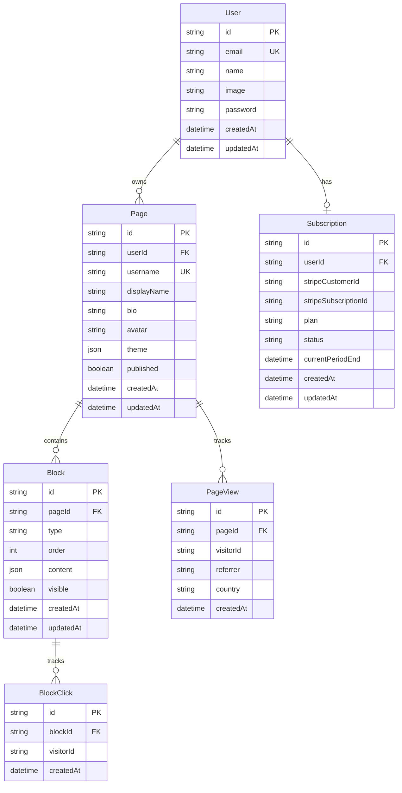

# Keepo Clone - Database Schema

## Overview

The application uses PostgreSQL with Prisma ORM. This document describes the complete database schema.

---

## Entity Relationship Diagram



---

## Prisma Schema

```prisma
// prisma/schema.prisma

generator client {
  provider = "prisma-client-js"
}

datasource db {
  provider = "postgresql"
  url      = env("DATABASE_URL")
}

// ============================================
// AUTHENTICATION
// ============================================

model User {
  id            String    @id @default(cuid())
  email         String    @unique
  emailVerified DateTime?
  name          String?
  image         String?
  password      String?   // Null for OAuth users

  // Relations
  accounts      Account[]
  sessions      Session[]
  pages         Page[]
  subscription  Subscription?

  createdAt DateTime @default(now())
  updatedAt DateTime @updatedAt
}

model Account {
  id                String  @id @default(cuid())
  userId            String
  type              String
  provider          String
  providerAccountId String
  refresh_token     String? @db.Text
  access_token      String? @db.Text
  expires_at        Int?
  token_type        String?
  scope             String?
  id_token          String? @db.Text
  session_state     String?

  user User @relation(fields: [userId], references: [id], onDelete: Cascade)

  @@unique([provider, providerAccountId])
}

model Session {
  id           String   @id @default(cuid())
  sessionToken String   @unique
  userId       String
  expires      DateTime
  user         User     @relation(fields: [userId], references: [id], onDelete: Cascade)
}

model VerificationToken {
  identifier String
  token      String   @unique
  expires    DateTime

  @@unique([identifier, token])
}

// ============================================
// BIO PAGE
// ============================================

model Page {
  id          String   @id @default(cuid())
  userId      String
  username    String   @unique  // URL slug: app.com/username
  displayName String?
  bio         String?  @db.Text
  avatar      String?

  // Theme configuration (JSON)
  theme       Json     @default("{}")
  // Example: { "palette": "sunset", "customColors": {...}, "font": "inter" }

  published   Boolean  @default(false)

  // Relations
  user        User     @relation(fields: [userId], references: [id], onDelete: Cascade)
  blocks      Block[]
  pageViews   PageView[]

  createdAt   DateTime @default(now())
  updatedAt   DateTime @updatedAt

  @@index([userId])
}

model Block {
  id       String  @id @default(cuid())
  pageId   String
  type     BlockType
  order    Int
  visible  Boolean @default(true)

  // Block content varies by type (JSON)
  content  Json    @default("{}")

  // Relations
  page     Page    @relation(fields: [pageId], references: [id], onDelete: Cascade)
  clicks   BlockClick[]

  createdAt DateTime @default(now())
  updatedAt DateTime @updatedAt

  @@index([pageId])
}

enum BlockType {
  LINK
  HIGHLIGHT
  MEDIA
  CATALOG
  FORM
  SOCIAL_ICONS
  TEXT
  DIVIDER
}

// ============================================
// SUBSCRIPTIONS
// ============================================

model Subscription {
  id                   String   @id @default(cuid())
  userId               String   @unique
  stripeCustomerId     String   @unique
  stripeSubscriptionId String?  @unique
  plan                 Plan     @default(FREE)
  status               SubscriptionStatus @default(ACTIVE)
  currentPeriodEnd     DateTime?

  // Relations
  user                 User     @relation(fields: [userId], references: [id], onDelete: Cascade)

  createdAt            DateTime @default(now())
  updatedAt            DateTime @updatedAt
}

enum Plan {
  FREE
  PLUS_MONTHLY
  PLUS_ANNUAL
}

enum SubscriptionStatus {
  ACTIVE
  CANCELED
  PAST_DUE
  UNPAID
  TRIALING
}

// ============================================
// ANALYTICS
// ============================================

model PageView {
  id         String   @id @default(cuid())
  pageId     String
  visitorId  String   // Anonymous visitor fingerprint
  referrer   String?
  userAgent  String?
  country    String?
  city       String?

  page       Page     @relation(fields: [pageId], references: [id], onDelete: Cascade)

  createdAt  DateTime @default(now())

  @@index([pageId])
  @@index([createdAt])
}

model BlockClick {
  id         String   @id @default(cuid())
  blockId    String
  visitorId  String

  block      Block    @relation(fields: [blockId], references: [id], onDelete: Cascade)

  createdAt  DateTime @default(now())

  @@index([blockId])
  @@index([createdAt])
}
```

---

## Block Content Schemas

Each block type has a specific JSON schema for its `content` field:

### LINK Block

```typescript
interface LinkBlockContent {
  url: string;
  label: string;
  icon?: string; // Icon name or URL
  style?: "solid" | "outline" | "ghost";
}
```

### HIGHLIGHT Block

```typescript
interface HighlightBlockContent {
  title: string;
  description?: string;
  image?: string;
  url?: string;
  layout?: "card" | "horizontal";
}
```

### MEDIA Block

```typescript
interface MediaBlockContent {
  type: "youtube" | "vimeo" | "spotify" | "soundcloud" | "image";
  embedUrl: string;
  title?: string;
  thumbnail?: string;
}
```

### CATALOG Block

```typescript
interface CatalogBlockContent {
  items: Array<{
    id: string;
    name: string;
    description?: string;
    price?: number;
    currency?: string;
    image?: string;
    url?: string;
  }>;
  layout?: "grid" | "list";
}
```

### FORM Block

```typescript
interface FormBlockContent {
  title?: string;
  description?: string;
  fields: Array<{
    id: string;
    type: "text" | "email" | "textarea";
    label: string;
    required: boolean;
  }>;
  submitLabel?: string;
  webhookUrl?: string; // Where to send form data
}
```

### SOCIAL_ICONS Block

```typescript
interface SocialIconsBlockContent {
  icons: Array<{
    platform:
      | "instagram"
      | "tiktok"
      | "twitter"
      | "youtube"
      | "linkedin"
      | "github"
      | "facebook"
      | "whatsapp";
    url: string;
  }>;
  style?: "colored" | "monochrome";
  size?: "sm" | "md" | "lg";
}
```

### TEXT Block

```typescript
interface TextBlockContent {
  content: string; // Markdown or HTML
  alignment?: "left" | "center" | "right";
}
```

---

## Theme Configuration Schema

```typescript
interface ThemeConfig {
  // Preset palette or custom
  palette?: "default" | "sunset" | "ocean" | "forest" | "neon" | "custom";

  // Custom colors (if palette === 'custom')
  customColors?: {
    background: string;
    foreground: string;
    primary: string;
    secondary: string;
    card: string;
    cardForeground: string;
    border: string;
  };

  // Dark/Light mode preference
  mode?: "light" | "dark" | "system";

  // Typography
  font?: "inter" | "roboto" | "outfit" | "poppins";

  // Layout
  buttonStyle?: "rounded" | "pill" | "square";
  cardStyle?: "elevated" | "flat" | "bordered";
}
```

---

## Indexes and Performance

### Query Optimization

- User lookup by email (authentication)
- Page lookup by username (public access)
- Blocks by pageId ordered by order
- Analytics aggregation by pageId and date range

### Recommended Indexes

```sql
CREATE INDEX idx_page_username ON "Page"("username");
CREATE INDEX idx_block_page_order ON "Block"("pageId", "order");
CREATE INDEX idx_pageview_page_date ON "PageView"("pageId", "createdAt");
CREATE INDEX idx_blockclick_block_date ON "BlockClick"("blockId", "createdAt");
```

---

## Migration Strategy

### Initial Setup

```bash
# Generate Prisma client
npx prisma generate

# Create migration
npx prisma migrate dev --name init

# Seed database (optional)
npx prisma db seed
```

### Production Deployment

```bash
# Apply migrations in production
npx prisma migrate deploy
```
